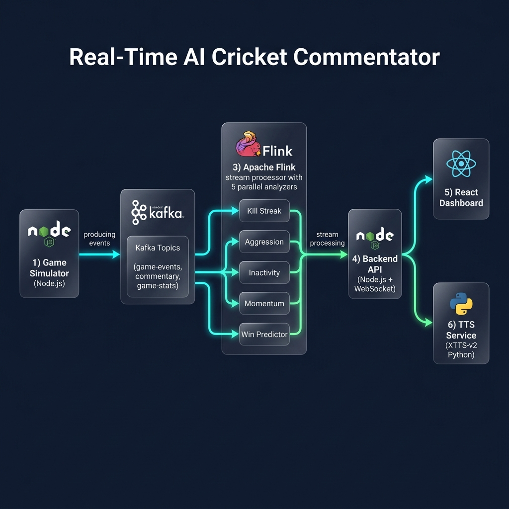
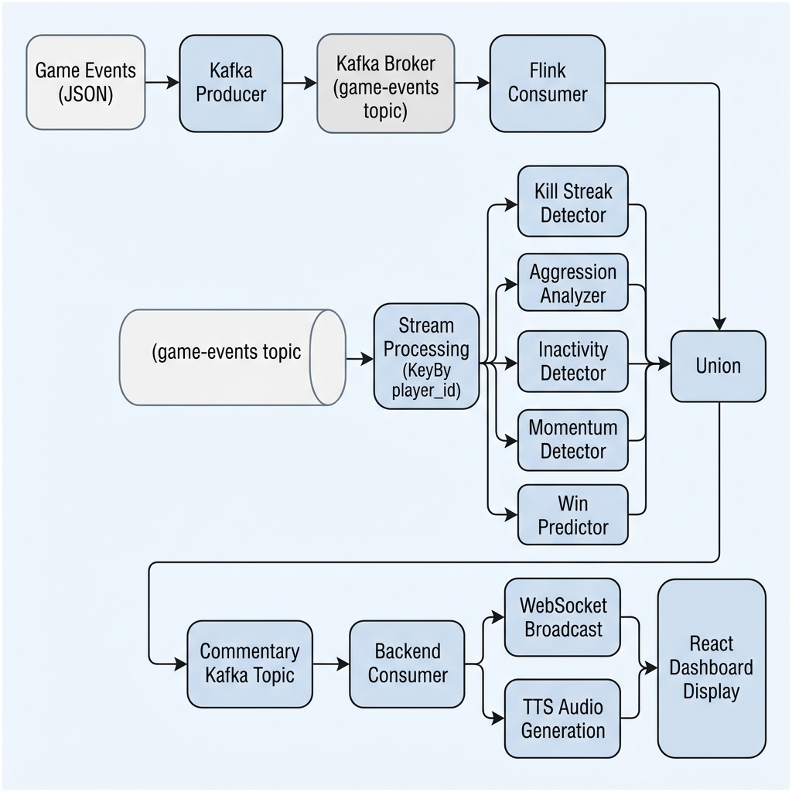
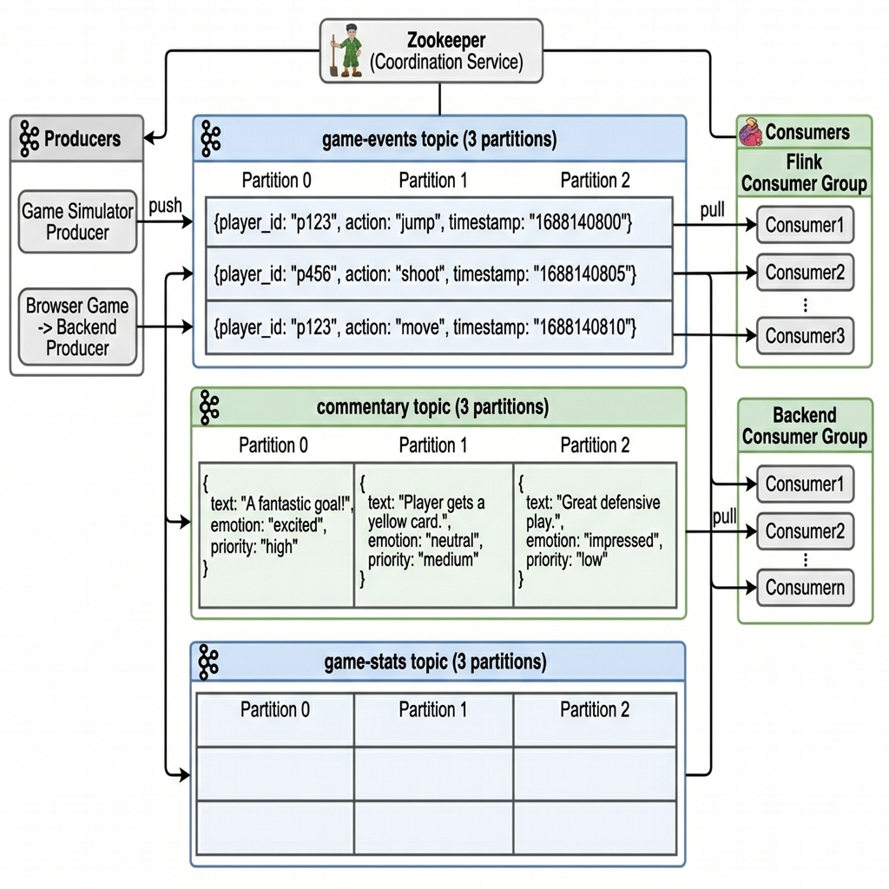
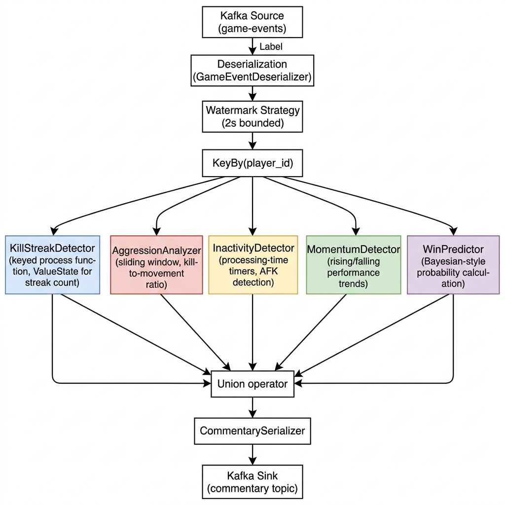
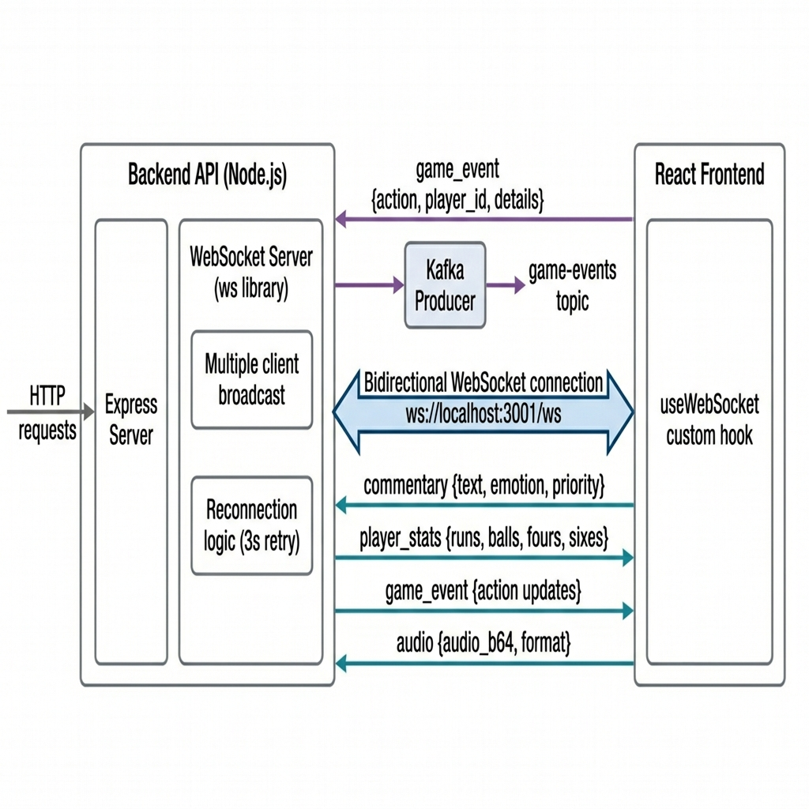
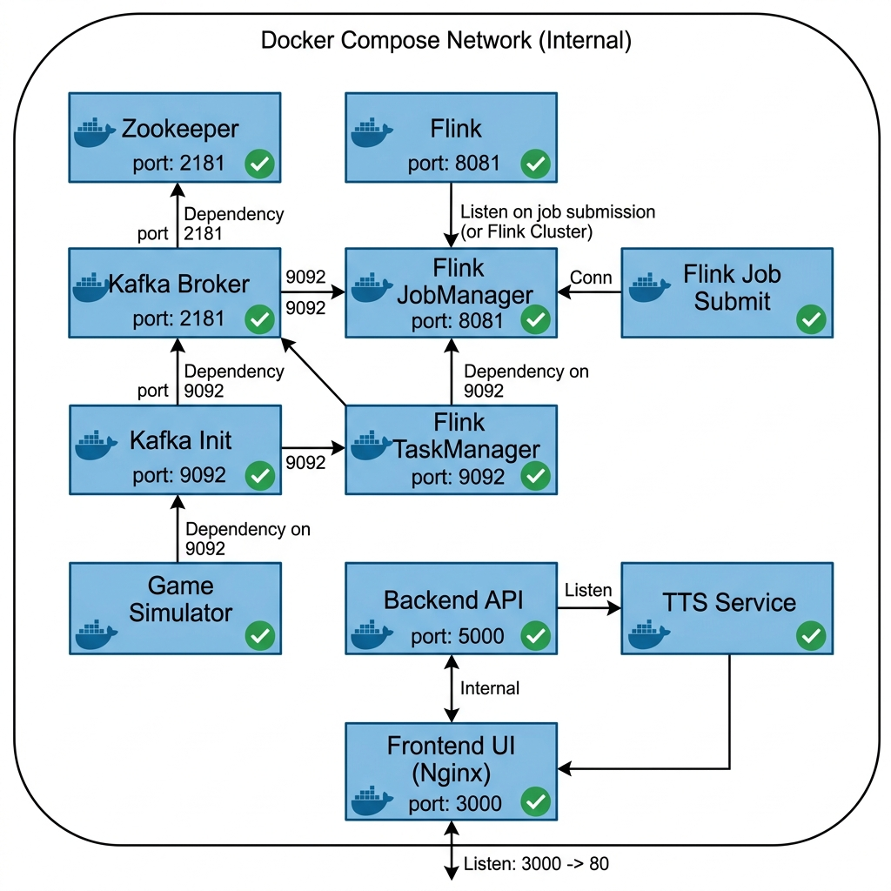
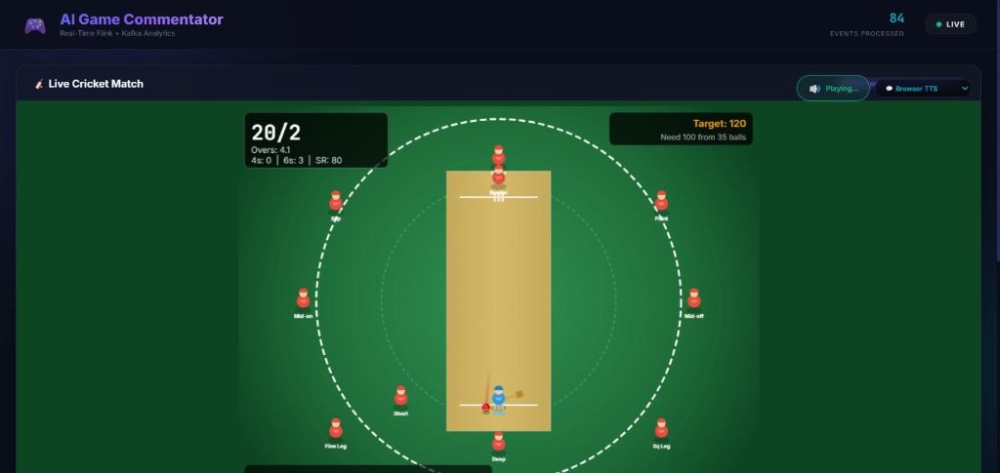
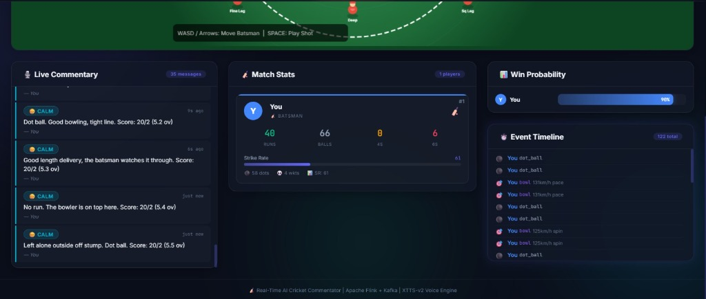
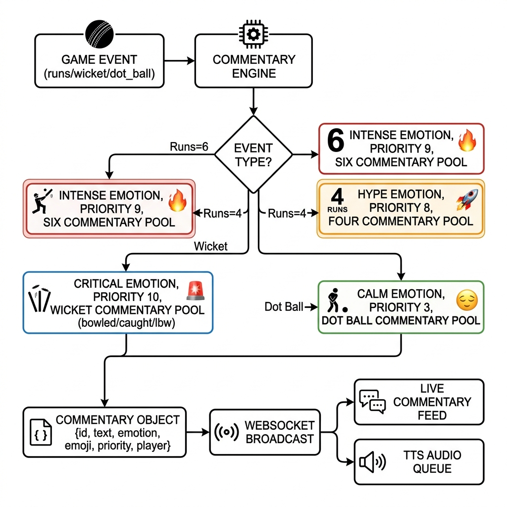
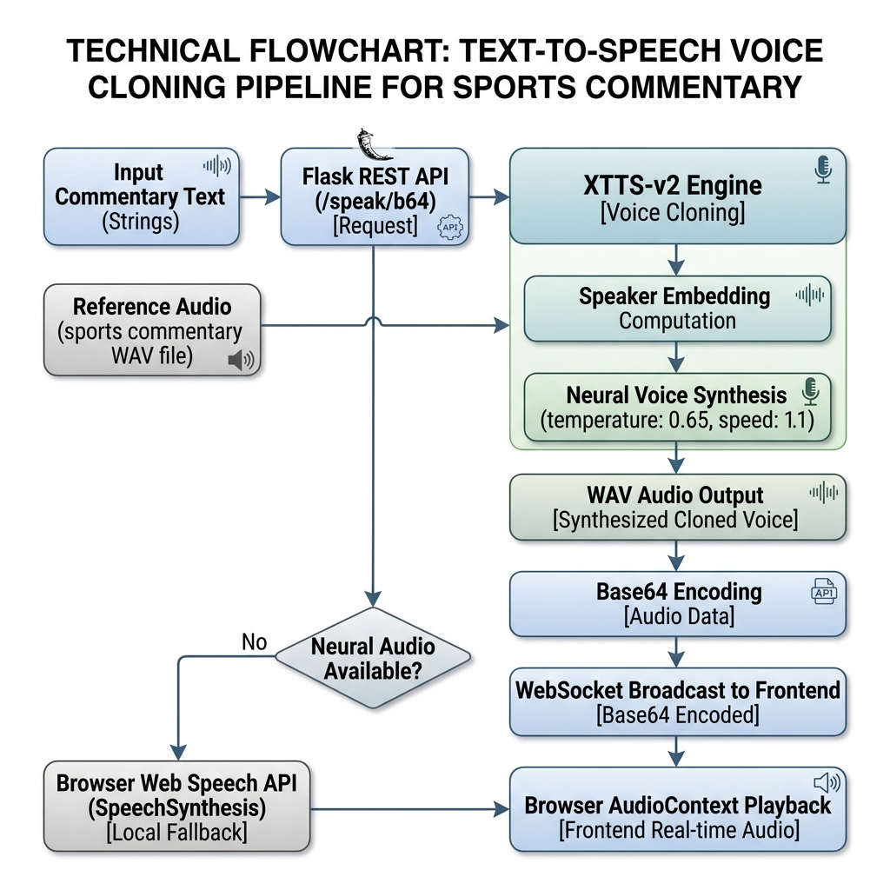

# Execution Steps Document (Assignment 2)

## Student Details
- Name: Maloth Srujan Nayak
- Roll No: 1601-23-737-189
- Project: Real-Time AI Cricket Commentator

## 1) Prerequisites
- Docker Desktop (running)
- Node.js and npm
- Java 11+ and Maven (for Flink build path)
- Python 3.11 (for TTS service components)

## 2) Project Structure Used
- `docker-compose.yml`
- `backend-api/`
- `frontend-ui/`
- `flink-processor/`
- `tts-service/`
- `game-simulator/` (legacy profile)

## 3) Main Execution Commands
Run these commands from project root.

```powershell
cd C:\Users\sruja\Documents\BDA-Flink+Kafka
```

```powershell
docker compose up --build -d
```

```powershell
docker compose ps
```

```powershell
docker compose logs -f backend-api
```

```powershell
docker compose logs -f flink-job-submit
```

```powershell
docker compose logs -f tts-service
```

```powershell
docker compose down
```

## 4) Service Access URLs
- Frontend UI: http://localhost:3000
- Backend API Health: http://localhost:3001/api/health
- Flink Dashboard: http://localhost:8081
- TTS Service Health: http://localhost:5001/health

## 5) How Execution Works (Observed Flow)
1. Open frontend and start the cricket game.
2. Browser sends game events using WebSocket to backend.
3. Backend publishes events to Kafka topic `game-events`.
4. Flink consumes events, runs 5 parallel analyzers, and emits commentary to `commentary` topic.
5. Backend consumes commentary, broadcasts text to frontend, and requests TTS audio for high-priority lines.
6. Frontend renders commentary feed, stats, timeline, and plays audio.

## 6) Output / Architecture Images
### 6.1 System Architecture


### 6.2 Data Flow Pipeline


### 6.3 Kafka Topic/Event Flow


### 6.4 Flink Processing Pipeline


### 6.5 WebSocket Real-Time Communication


### 6.6 Docker Container Architecture


### 6.7 Frontend Output Screen (Match Field)


### 6.8 Frontend Output Screen (Dashboard)


### 6.9 Commentary Generation Flow


### 6.10 TTS Voice Pipeline


## 7) Notes
- For first run, TTS model loading may take additional time.
- Text commentary appears in sub-second latency; audio can be delayed on CPU.
- Flink checkpoints are enabled to improve fault tolerance.
